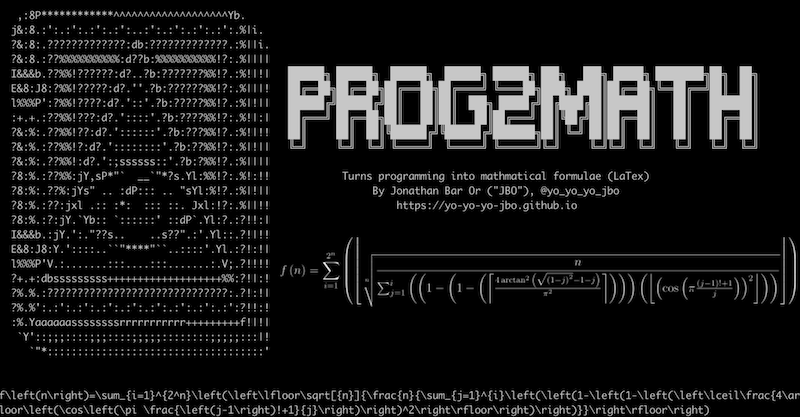

# Prog2Math - the relation between programming and mathematical formulae


Some say you must know math to truly know programming, while others claim that's false.  
In the modern world, many mathematicians also have to know how to code (e.g. using [Sage](https://www.sagemath.org)) to test hypothesis or avoid doing a lot of manual work.  
One thing that I found surprising is a deep connection between mathematical formulae and programming, in a sense that a math formula is essentially a deterministic algorithm - given some input - get an output.  
This blogpost is heavily inspired by [Willan's formula](https://mathworld.wolfram.com/WillansFormula.html) but I will show you how I got to alternative formulae for primes, and much more.  
If scary math equations scare you, you are not alone - together I hope we get to build-up some sort of "programming building blocks" that would help us undertake this task.

## What constitutes a formula?
That's a tough question - generally mathematical formulae are algorithmic in nature, but some of them might actually be very hard to be useful.  
For example, $\sum_{k=1}^{\infty}\frac{1}{k^2}$ might look like it has an *infinite* number of steps, but it's really just a fancy way to express $\frac{\pi^2}{6}$.  
On the other hand, we must be very careful - formulae that have division by zero or infinite sums that do not converge are nonsensical (in most "normal" situations, anyway).  
Therefore, I try to stick to the following rules:
1. All formulae that I consider must avoid doing anything nonsensical (such as division by zero and others).
2. I use LaTeX type of formulae, which is easy to turn into human-readable text.
3. I avoid infinities (even when it does make sense, e.g. avoid this: $\max_{k\in\mathbb{N^+}}\{\frac{1}{k}\}$.
4. Formulaes can be highly inefficient in terms of time-complexity, which is acceptible.

With that, let's get started!

## Conditions
For conditions, our goal is using `Indicators`. An `indicator` is a function that gets a single input and outputs either `0` or `1` - *indicating* whether some conditions is true for the number. That is very helpful as `0` and `1` have special roles in mathematics:
- Adding `0` to any sum does not change it.
- Multiplying by `0` makes the entire product `0`.
- Adding `1` helps us count - if we added the number `1` five times to itself - we get a `5`.
- Multiplying by `1` des not change the product.

### Logical conditions
- `Logical not` (negation) is easy - assuming our input is also an indicator `I`, we apply $1-I\left(n\right)$, which will turn a `0` into a `1` and vice-versa.
- `Logical and` conditions are also easy, as we are working with indicators, we simply multiply conditions: `a and b` is really $ab$ - as it only takes one of the inputs to be `0` in order for the entire result to be `0`.
- `Logical or` is a bit more complicated, we could address it in several ways. One approach is adding all terms and test if the result is positive - we could implement that (see later about `non-negativity`), but at this point, since we have `and` and `not`, we could apply [The Morgan's laws](https://en.wikipedia.org/wiki/De_Morgan's_laws): `a or b` is equivalent to `not((not a) and (not b))`, which simply turns into this: `a or b` is $1-\left(1-a\right)\left(1-b\right)$. To convince yourself this is true - feel free to assign all `0` and `1` combinations (there are only 4 such combinations) and see how the result yields the logical result of an `or` condition.

### Inequality and equality
- `Inequality` has one main idea - using the `arctan` function, which turns a `0` into a `0` and all other inputs into non-zero values in the range $\left(-\frac{\pi}{2},\frac{\pi}{2}\right)$. We turn all negative values to positive ones by squaring, and then normalize by $\frac{\pi^2}{4}$ due to the squaring.  
This gives us a number between 0 and 1, where `0` is only yielded for the input `0`. Then, we simply use the ceiling function, which means all input turn into `1` except for the input `0`. Therefore, the condition `a != b` can turn into $\left\lceil\frac{4\arctan^2{\left(a-b\right)}}{\pi^2}\right\rceil$. Again - to convince yourself, notice `arcsin` yields `0` *only* when the input is `0`, which can happen only if `a == b`.
- `Equality` is easy given inequality - obviously we can now combine negation with inequality to test for equality: `a == b` is implemented as: $1-\left\lceil\frac{4\arctan^2{\left(a-b\right)}}{\pi^2}\right\rceil$.

### Non-negativity and bigger-than comparisons
- `Non-negativity` could compare the absolute value of a number with that number. This can be implemented by calling the equality test on $\sqrt{x^2}$ (which is the absolute value of a number) and `x`: $1-\left\lceil\frac{4\arctan^2{\left(\sqrt{x^2}-x\right)}}{\pi^2}\right\rceil$.
- `Less-than-or-equal-to` indicator is now quite trivial: to check if `a <= b`, we could check non-negativity on `b-a`: $1-\left\lceil\frac{4\arctan^2{\left(\sqrt{\left(b-a\right)^2}-\left(b-a\right)\right)}}{\pi^2}\right\rceil$.  
- `Strictly-less-than` is also obvious, as `a < b` is equivalent to `not (b <= a)`.
- `Strictly-bigger-than` can be implemented trivially: `a > b` is just `b < a` which we have already done.
- `Bigger-than-or-equal-to` is similarly implemented: `a >= b` is just `b <= a`.

### Integer test
- `Integer test` could be done very similarly to what we have done before with trigonometry. Given the input `x`, we could use the `cosine` function on $x\pi$ - which yields `-1` and `1` if and only if `x` is an integer, and a number between those otherwise. Therefore, squaring the result gives us a number in the range $\left[0,1\right]$ and yields `1` only when `x` is an integer. We use the `floor` function on the result to make all non-1 numbers yield `0`. To summarize, $x\in\mathbb{Z}$ can be implemented as $\left\lfloor\cos^2\left(\pi x\right)\right\rfloor$.
- `Natural number testing` can now be implemented easily: $x\in\mathbb{N}$ (`x` is a Natural number) can be implemented by adding the integer test with `x>0` (or `x>=0` if you insist that $0\in\mathbb{N}$).

## Mathematical operations
Obviously the "usual" operations of addition, substruction, multipication, division, square roots and powers are free.  
However, there are some cool mathematical tricks we could use for our benefit.

### Divisibility
- Assuming `a` is not `0`, we can check if `a` divides `b` by testing if $\frac{b}{a}$ is an integer.
- To get `a % b` (the remainder) we could use the floor function: $a - b\left\lfloor\frac{a}{b}\right\rfloor$.

### Primality test
- The easiest (yet very inefficient) primality test relies on [Wilson's theorem](https://en.wikipedia.org/wiki/Wilson%27s_theorem), in essence, `n` is prime if `n > 1` and $\frac{\left(n-1\right)!+1}{n}$ is an integer.
- One more idea would just be iterating all numbers between `2` and `n-1` and performing divisibility tests on all of them, which can be done with summation of $\sum_{k=2}^{n-1}$.
- Lastly, instead of a summation we could use the multiplication of $\prod_{k=2}^{n-1}$ and making sure none of them divide `n`.

### Getting a number's digits
- We could use the floor function to get the decimal digits of a number after the decimal point: $\left\lfloor10^n x\right\rfloor - 10\left\lfloor10^{n-1} x\right\rfloor$.

## Loops and ranges
Loops are an essential part of programming, and do not exist in "traditional" math formulae as simply as they appear in programming.  
However, we could still use sums and products to "iterate" through a loop.

### Counting and checks for all indicators
- This is where our indicators really pay off - given an indicator `I` we simply sum them. For example, to count how many numbers yield `1` from the indicator `I` in the range of integers between `1` and `10`, we yield: $\sum_{k=1}^{10}\left(I\left(k\right)\right)$.
- To ensure all numbers in a range yield `1` for the given indicator `I`, we can multiply them all: $\prod_{k=1}^{10}\left(I\left(k\right)\right)$.
- Given an indicator, we can now check if at least `n` elements yield true. This was originally done by Willans by using the function $\left\lfloor\sqrt[n]{\frac{n}{k}}\right\rfloor$ which yields `1` if and only if `n >= k`. However, we already have the comparison for `>=` so we can use either.

## Combining it all together
I built a Python script that gets a JSON, parses everything there and outputs the formula.  
Here's an example:

```json
{
  "compose":
  {
    "a": "f\\left(n\\right)=\\sum_{i=1}^{2^n}",
    "b": {
      "is_range_at_least_exp": {
        "lo": 1,
        "hi": "i",
        "n": "n",
        "index_letter": "j",
        "indicator": {
          "is_prime_divisors": {
            "a": "j"
          }
        }
      }
    }
  }
}
```

I run `./prog2math.py -j examples/prime_gen_divisors.json` I get:

```
f\left(n\right)=\sum_{i=1}^{2^n}\left(\left\lfloor\sqrt[{n}]{\frac{n}{\sum_{j=1}^{i}\left(\left(\left(\left\lfloor\left(\cos\left(\pi j\right)\right)^2\right\rfloor\right)\left(1-\left(1-\left(\left\lceil\frac{4\arctan^2{\left(\sqrt{\left(0-j\right)^2}-0-j\right)}}{\pi^2}\right\rceil\right)\right)\right)\right)\left(\left(\left\lfloor\left(\cos\left(\pi \prod_{i=2}^{j-1}\left(1-\left(\left\lfloor\left(\cos\left(\pi \frac{j}{i}\right)\right)^2\right\rfloor\right)\right)\right)\right)^2\right\rfloor\right)\left(1-\left(1-\left(\left\lceil\frac{4\arctan^2{\left(\sqrt{\left(0-\prod_{i=2}^{j-1}\left(1-\left(\left\lfloor\left(\cos\left(\pi \frac{j}{i}\right)\right)^2\right\rfloor\right)\right)\right)^2}-0-\prod_{i=2}^{j-1}\left(1-\left(\left\lfloor\left(\cos\left(\pi \frac{j}{i}\right)\right)^2\right\rfloor\right)\right)\right)}}{\pi^2}\right\rceil\right)\right)\right)\right)\right)}}\right\rfloor\right)
```

We can easily present that - this is my forumula for the `n`-th prime!

$f\left(n\right)=\sum_{i=1}^{2^n}\left(\left\lfloor\sqrt[{n}]{\frac{n}{\sum_{j=1}^{i}\left(\left(\left(\left\lfloor\left(\cos\left(\pi j\right)\right)^2\right\rfloor\right)\left(1-\left(1-\left(\left\lceil\frac{4\arctan^2{\left(\sqrt{\left(0-j\right)^2}-0-j\right)}}{\pi^2}\right\rceil\right)\right)\right)\right)\left(\left(\left\lfloor\left(\cos\left(\pi \prod_{i=2}^{j-1}\left(1-\left(\left\lfloor\left(\cos\left(\pi \frac{j}{i}\right)\right)^2\right\rfloor\right)\right)\right)\right)^2\right\rfloor\right)\left(1-\left(1-\left(\left\lceil\frac{4\arctan^2{\left(\sqrt{\left(0-\prod_{i=2}^{j-1}\left(1-\left(\left\lfloor\left(\cos\left(\pi \frac{j}{i}\right)\right)^2\right\rfloor\right)\right)\right)^2}-0-\prod_{i=2}^{j-1}\left(1-\left(\left\lfloor\left(\cos\left(\pi \frac{j}{i}\right)\right)^2\right\rfloor\right)\right)\right)}}{\pi^2}\right\rceil\right)\right)\right)\right)\right)}}\right\rfloor\right)$

Woah. A bit less elegant than Willan's formula, but works well.  
I also added some other things to the examples directory, including Willan's formula (slightly changed):

$f\left(n\right)=\sum_{i=1}^{2^n}\left(\left\lfloor\sqrt[{n}]{\frac{n}{\sum_{j=1}^{i}\left(\left(1-\left(1-\left(\left\lceil\frac{4\arctan^2{\left(\sqrt{\left(1-j\right)^2}-1-j\right)}}{\pi^2}\right\rceil\right)\right)\right)\left(\left\lfloor\left(\cos\left(\pi \frac{\left(j-1\right)!+1}{j}\right)\right)^2\right\rfloor\right)\right)}}\right\rfloor\right)$

## Summary
I hope this quite odd blogpost was informative.  
There's more work to be done - e.g. there's no concept of "memory" in formulae - can we come up with such a concept?  
I'd love to see more cool ideas of generating interesting formulae - feel free to add a pull request :)

Stay tuned!

Jonathan Bar Or
